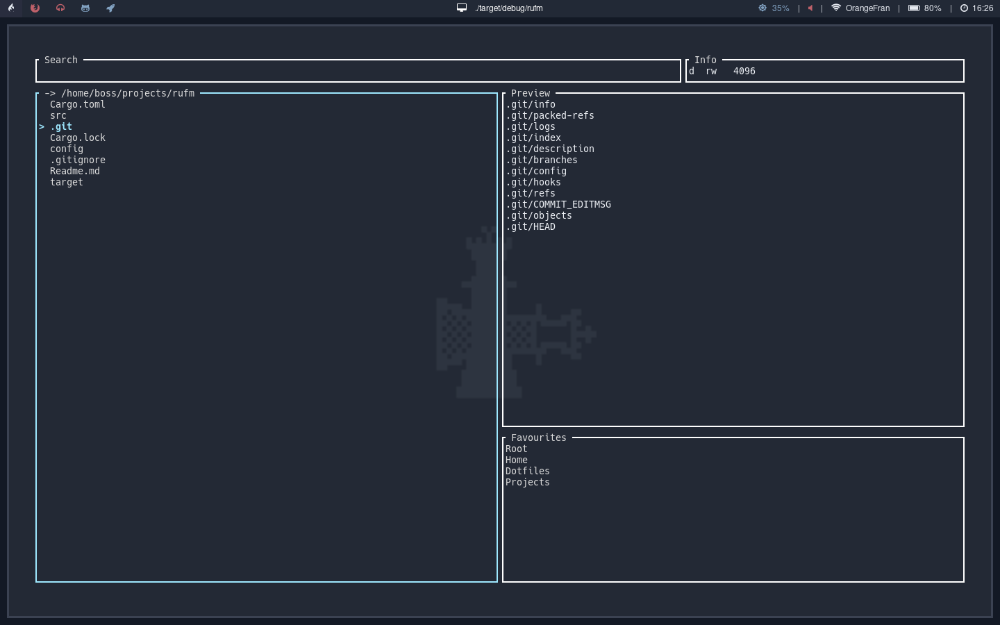
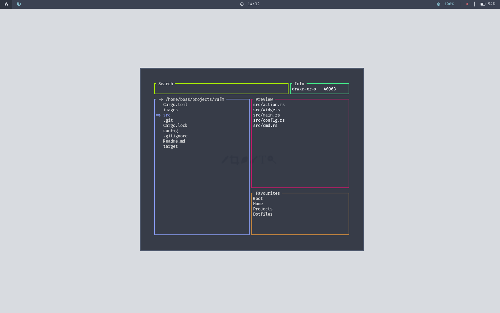

# Rufm - **Ru**st **Fi**le **Ma**nager

Rufm is a file manager written in rust with a responsive terminal user interface (tui) and basic functionality for linux.




# 
## Content

* Installation
* Usage & Configuration
* Dependencies

# 
## Installation

Because rufm was built with rust the installation and compilation isn't very complicated!

* Clone the repo:
``` bash
git clone https://github.com/OrangeFran/rufm.git
cd rufm
```

* Start the build process with cargo:
``` bash
cargo build
```

You have now built your executable binary. To run it change to the target/debug directory and run ./rufm:

``` bash
cd target/debug 
./rufm 
```

If you want to be able to run rufm from every directory you have to copy it to a location which is in your PATH. You could use /usr/bin:

``` bash
sudo cp rufm /usr/bin/rufm
```

# 
## Usage & Configuration

This project is in it's early states. Currently there aren't many features avaible.
I hope this is going to change in the near future.

To use rufm just type "rufm" into the terminal and it should start (only if you copied it somewhere in your PATH).

Use the help menu for more information and avaible flags.
``` bash
rufm --help
```

To configure rufm you have to edit or create the configuration file located at "~/.config/rufm/config.ini". Alternatively you can use the "-c" flag to point to another configuratin file.
The default should look like this:

``` toml
# rgb color codes
# -> [red, green, blue]
[colors]
border_normal = [255, 255, 255]
border_highlight = [158, 232, 255]

# to use no colors, just comment them out 
text_highlight.fg = [158, 232, 255]
# text_highlight.bg = [0, 0, 0]

# favourites
[favourites]
names = ["Root", "Home"]
paths = ["/", "~"]
```

Note that names and favourites have to be of the same length.

Keyboard shortcuts:

Capital letters stand for actions, non-capital letters for navigation.

- D => Deletes a file or directory,
- C => Copies a file or directory,
- P => Pastes a copied file or directory,
- R => Renames a file or directory

- F => Switch to the favourites tab

- / => Switch to search

- Esc => Exit and switch back to the filelist
- Enter => Select the element

h, j, k, l (vim keys) or the four arrow keys can be used for navigation.

# 
## Dependencies

To draw the tui I used:
- tui-rs => https://github.com/fdehau/tui-rs
- termion => https://github.com/redox-os/termion

To read from the configuration file I used:
- toml => https://github.com/alexcrichton/toml-rs
- serde and serde_derive => https://github.com/serde-rs/serde

#
## Other stuff

If you like it, let me know what you would like to have implemented next.
I personally thought of a config setting, which allows you to remap keys.
Have fun!
