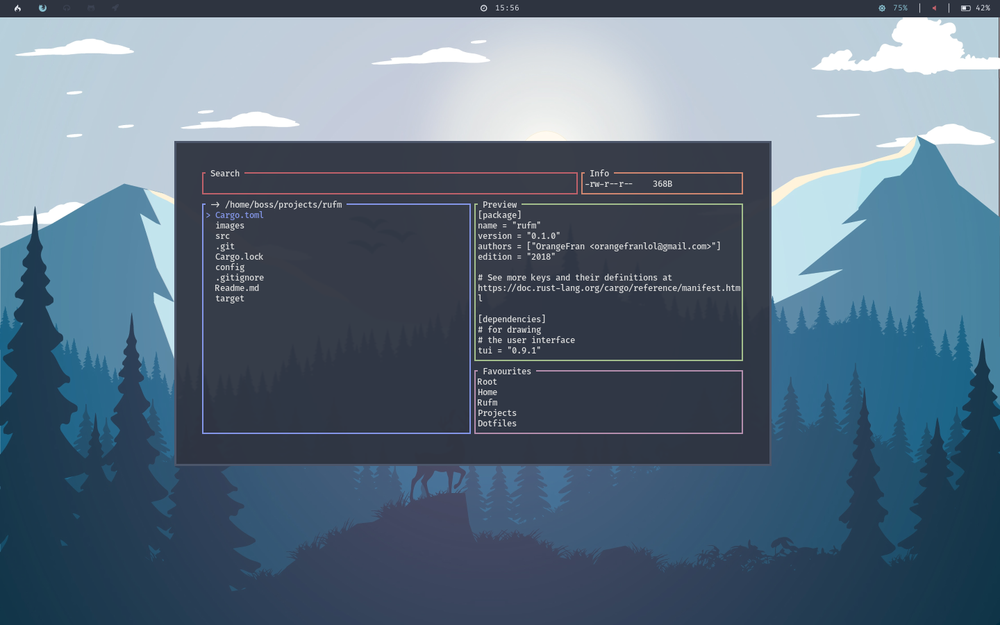

# Rufm
## **Ru**st **F**ile **M**anager

Rufm is a file manager written in rust with a responsive terminal user interface (tui) and basic functionality for linux.
It probably works on MacOSX as well, but I haven't tested it yet. If you tried it, let me know if it works for you.



#
## Content

* [Installation](#installation)
* [Usage](#usage)
* [Shortcuts](#shortcuts)
* [Configuration](#configuration)
* [Notes](#notes)
* [Dependencies](#dependencies)

# 
## Installation

Because rufm was built with rust the installation and compilation isn't very complicated!
And because I haven't used many other crates it should not be too slow, probably like one or two minutes.

* Clone the repo:
``` bash
git clone https://github.com/OrangeFran/rufm.git
cd rufm
```

* Start the build process with cargo:
``` bash
cargo build
```

You have now built your executable binary. To run it change to the target/debug directory and run ./rufm:

``` bash
cd target/debug 
./rufm 
```

If you want to be able to run rufm from every directory you have to copy it to a location which is in your PATH. You could use /usr/bin:

``` bash
sudo cp rufm /usr/bin/rufm
```

# 
## Usage

This project is in it's early states. Currently there aren't many features avaible.
I hope this is going to change in the near future.

To use rufm just type "rufm" into the terminal and it should start (only if you copied it somewhere in your PATH).

You can use flags to change the behaviour.
If you want to use a custom path for your configuration file, use "-c".
Example: use the configuration file located at currentworkingdirectory/config/config.ini
``` bash
rufm -c config/config.ini
```
If you want to start rufm in a different directory, use "-d".
Example: start rufm in your home directory
``` bash
rufm -d ~
```
Use the help menu if you forget something:
``` bash
rufm --help
```

#
## Shortcuts

### General

Because rufm is based on a terminal user interface you can only navigate while using keyboard shortcuts. In a nutshell, capital letters stand for actions, non-capital letters for navigation. The layout consist of 5 elements. The search tab, the info tab, a file list, a favourites list and a preview paragraph.
The shortcuts differ from eachother, but some are always the same. For example:


### File list

|Action           |Key              |Remapping         |
|:---------------:|:---------------:|:----------------:|
|up               |k / :arrow_up:   |:x:               |
|down             |j / :arrow_down: |:x:               |
|left             |h / :arrow_left: |:x:               |
|right            |l / :arrow_right:|:x:               |
|                 |                 |                  |
|select/deselect  |space            |:white_check_mark:|
|                 |                 |                  |
|copy files       |C                |:white_check_mark:|
|paste files      |P                |:white_check_mark:|
|delete files     |D                |:white_check_mark:|
|                 |                 |                  |
|rename file      |R                |:white_check_mark:|
|                 |                 |                  |
|sort             |tab              |:white_check_mark:|
|open file        |enter            |:x:               |
|                 |                 |                  |
|switch to favs   |F                |:white_check_mark:|
|search file      |/                |:white_check_mark:|
|run shell cmd    |:                |:white_check_mark:|
|                 |                 |                  |
|quit             |q                |:x:               |


                  
### Favourites list

|Action           |Key              |Remapping         |
|:---------------:|:---------------:|:----------------:|
|up               |k / :arrow_up:   |:x:               |
|down             |j / :arrow_down: |:x:               |
|left             |h / :arrow_left: |:x:               |
|right            |l / :arrow_right:|:x:               |
|                 |                 |                  |
|cd to dir        |enter            |:x:               |
|switch to files  |esc              |:x:               |
|                 |                 |                  |
|quit             |q                |:x:               |

### Search tab

|Action           |Key              |Remapping         |
|:---------------:|:---------------:|:----------------:|
|apply search     |enter            |:x:               |
|switch to files  |esc              |:x:               |

#
## Configuration

NOTE: If you use an older version, you probably have to update your configuration file.

To configure rufm you have to edit or create the configuration file located at "~/.config/rufm/config.ini". You can find the default configuration file in the config folder.
For a quick start you can copy the example config:
``` bash
cp config/config.ini ~/.config/rufm/config.ini
```

Alternatively as shown in the usage section, you can use the "-c" flag to point to another configuratin file. Comments for easier use are provided.

The file should look like this:

``` toml
##  ____         __           
## |  _ \ _   _ / _|_ __ ___  
## | |_) | | | | |_| '_ ` _ \ 
## |  _ <| |_| |  _| | | | | |
## |_| \_\\__,_|_| |_| |_| |_|
##
## A file manager written in Rust

## If you want to use the default
## values, just comment them

## Colors are set in rgb form
## variable = [red, green, blue]

## Do not comment out things
## with two Hashtags in front of them
## these are just for information

## border colors
[borders]
search = [159, 222, 11]
info = [67, 222, 134]
filelist = [198, 40, 222]
preview = [222, 20, 111]
favourites = [222, 146, 60]

## colors and symbols
## used for highlighting
[highlights]
border = [132, 150, 232]
text.fg = [132, 150, 232]
# text.bg = [0, 0, 0]
symbol = "> "

## favourites
## names and paths 
## have to be the same length
[favourites]
names = ["Root", "Home"]
paths = ["/", "~"]

## keybindings
[keys]
rename = "R"
copy = "C"
paste = "P"
delete = "D"
search = "/"
sort = "\t"
favourites = "F"
select = " "
command = ":"

## other stuff
[other]
## cmd that opens the selected file
## if commented out, the $EDITOR is used + filename
## else the open_cmd + filename
# open_cmd = "code"
```

There a few things you have to consider:

- The arrays names and paths have to be the same length.
- You can comment out the commands to use the default (if one is needed (e.q keybindings) or no values. This means all values are optional.


#
## Notes

Now you know everything you need to get started. I hope you have fun and you can use my tool effectively. 
If you have suggestions or if you'd like to contribute, let me know through an issue.

# 
## Dependencies

To draw the tui I used:
- [tui-rs](https://github.com/fdehau/tui-rs)
- [termion](https://github.com/redox-os/termion)

To read from the configuration file I used:
- [toml](https://github.com/alexcrichton/toml-rs)
- [serde and serde_derive](https://github.com/serde-rs/serde)
