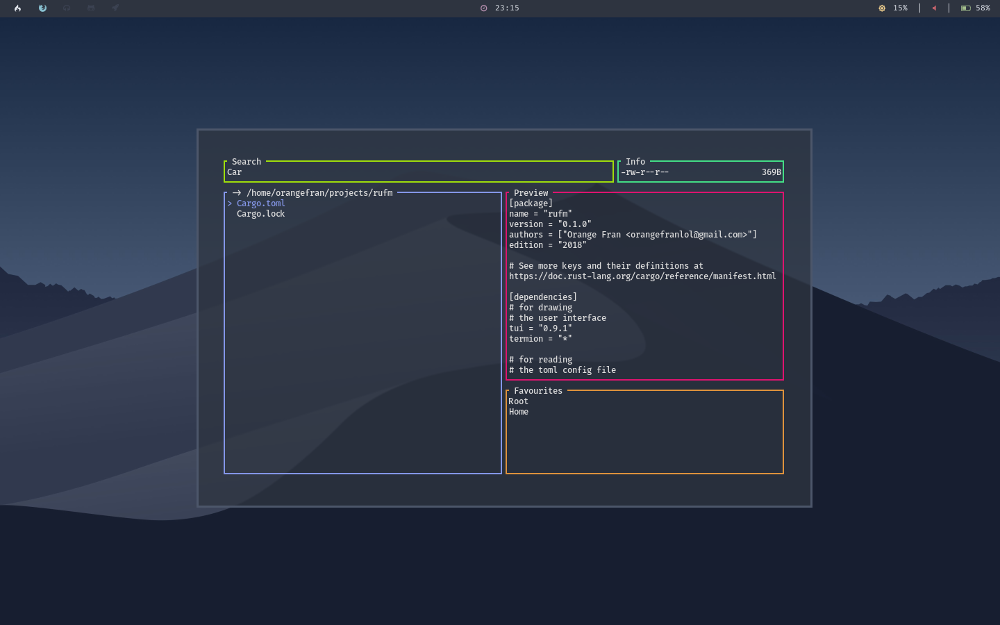

# Rufm
## **Ru**st **F**ile **M**anager

Rufm is a file manager written in rust with a responsive terminal user interface (tui) and basic functionality for linux.
It probably works on MacOSX as well, but I haven't tested it yet. If you tried it, let me know if it works for you.



#
## Content

* [Installation](#installation)
* [Usage](#usage)
* [Shortcuts](#shortcuts)
* [Configuration](#configuration)
* [Notes](#notes)
* [Dependencies](#dependencies)

# 
## Installation

Because rufm was built with rust the installation and compilation isn't very complicated!
And because I haven't used many other crates it should not be too slow, probably like one or two minutes.

* Clone the repo:
``` bash
git clone https://github.com/OrangeFran/rufm.git
cd rufm
```

* Start the build process with cargo:
``` bash
cargo build
```

You have now built your executable binary. To run it change to the target/debug directory and run ./rufm:

``` bash
cd target/debug 
./rufm 
```

If you want to be able to run rufm from every directory you have to copy it to a location which is in your PATH. You could use /usr/bin:

``` bash
sudo cp rufm /usr/bin/rufm
```

# 
## Usage

This project is in it's early states. Currently there aren't many features avaible.
I hope this is going to change in the near future.

To use rufm just type "rufm" into the terminal and it should start (only if you copied it somewhere in your PATH).

You can use flags to change the behaviour.
If you want to use a custom path for your configuration file, use "-c".
Example: use the configuration file located at currentworkingdirectory/config/config.ini
``` bash
rufm -c config/config.ini
```
If you want to start rufm in a different directory, use "-d".
Example: start rufm in your home directory
``` bash
rufm -d ~
```
Use the help menu if you forget something:
``` bash
rufm --help
```

#
## Shortcuts

### General

Because rufm is based on a terminal user interface you can only navigate while using keyboard shortcuts. In a nutshell, capital letters stand for actions, non-capital letters for navigation. The layout consist of 5 elements. The search-tab, the info-tab, a file-list, a favourites-list and a preview-paragraph.
The shortcuts differ from eachother, but some are always the same. For example:

Esc always switches back to the file-list.
q quits the app.

### File-list

In the file-list you can navigate with the **vim keys (h, j, k, l)** or with **the four arrow keys**.
The left arrow key / h switches one directory back, the right arrow key / l into the selected directory.
Of course this isn't all.

To delete files or directories recursively use **D**. Afterwards your are asked for a confirmation with y or n / esc.
To copy files or directories use **C**. This only saves the paths in the clipboard. So you shouldn't delete them.
If you'd like to copy / delete multiple files or directories you can use **space** to select / deselect files or directories.
Note that copy and delete are going to use your selected one + the one you are currently on with your 'cursor'.
Also, if you switch the directories the selection is gonna get deleted. So you don't accidentaly delete files or directories.

To paste files or directories use **P**. Consider that the copied files or directories must exist.
To rename files or directories use **R**. This is gonna ask you for the new name. If you press tab it's automatically going to fill in the name of the selected element.

If you want to sort your files your left with three sorting styles. One sorts after length, another after the alphabet and the last one doesn't sort at all. To switch between them you can use the **tab**.

**Enter** opens the currently selected file or directory. By default this is going to use your $EDITOR + filename.

### Switch tabs

If you want to switch to the favouriteslist use **F**.
To search for files or directories in the current working directory use **/**.
Of course you can run shell commands as well. Use **:** to run a shell command. If you use tab, the same as in renaming happens.
Note that this is not going to spawn the command. It's only collecting the output. So you won't be able to open vim for example in the same terminal.

### Favourites list

To navigate use the same keys as in the file list.
Enter switches to the selected favourite path and back to the file list.

### Search tab

Enter applies the search and switches back to the file-list.

#
## Configuration

NOTE: If you use an older version, you probably have to update your configuration file.

To configure rufm you have to edit or create the configuration file located at "~/.config/rufm/config.ini". You can find the default configuration file in the config folder.
For a quick start you can copy the example config:
``` bash
cp config/config.ini ~/.config/rufm/config.ini
```

Alternatively as shown in the usage section, you can use the "-c" flag to point to another configuratin file. Comments for easier use are provided.

The file should look like this:

``` toml
##  ____         __           
## |  _ \ _   _ / _|_ __ ___  
## | |_) | | | | |_| '_ ` _ \ 
## |  _ <| |_| |  _| | | | | |
## |_| \_\\__,_|_| |_| |_| |_|
##
## A file manager written in Rust

## If you want to use the default
## values, just comment them

## Colors are set in rgb form
## variable = [red, green, blue]

## Do not comment out things
## with two Hashtags in front of them
## these are just for information

## border colors
[borders]
search = [159, 222, 11]
info = [67, 222, 134]
filelist = [198, 40, 222]
preview = [222, 20, 111]
favourites = [222, 146, 60]

## colors and symbols
## used for highlighting
[highlights]
border = [132, 150, 232]
text.fg = [132, 150, 232]
# text.bg = [0, 0, 0]
symbol = "> "

## favourites
## names and paths 
## have to be the same length
[favourites]
names = ["Root", "Home"]
paths = ["/", "~"]

## keybindings
[keys]
rename = "R"
copy = "C"
paste = "P"
delete = "D"
search = "/"
sort = "\t"
favourites = "F"
select = " "
command = ":"

## other stuff
[other]
##  basic information on startup
# startup_info = true
## cmd that opens the selected file
## if commented out, the $EDITOR is used + filename
## else the open_cmd + filename
# open_cmd = "code"
```

There a few things you have to consider:

- The arrays names and paths have to be the same length.
- You can comment out the commands to use the default (if one is needed (e.q keybindings) or no values. This means all values are optional.


#
## Notes

Now you know everything you need to get started. I hope you have fun and you can use my tool effectively. 
If you have suggestions or if you'd like to contribute, let me know through an issue.

# 
## Dependencies

To draw the tui I used:
- tui-rs => https://github.com/fdehau/tui-rs
- termion => https://github.com/redox-os/termion

To read from the configuration file I used:
- toml => https://github.com/alexcrichton/toml-rs
- serde and serde_derive => https://github.com/serde-rs/serde
